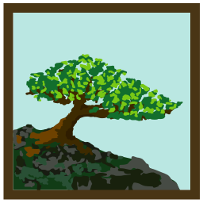
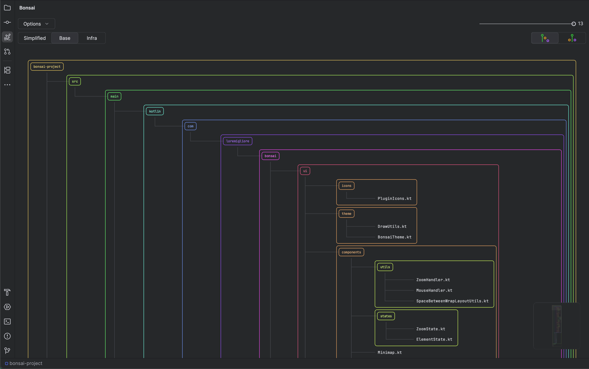
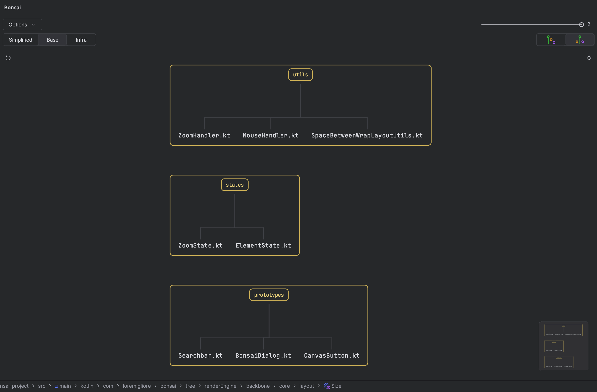
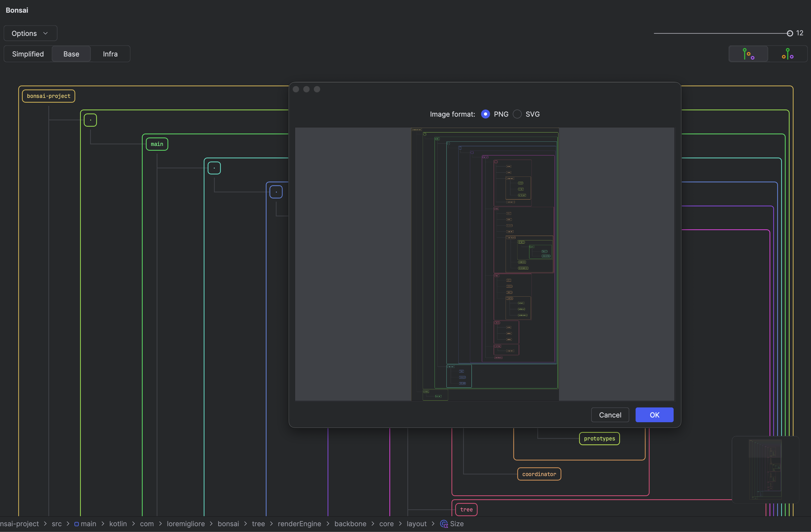
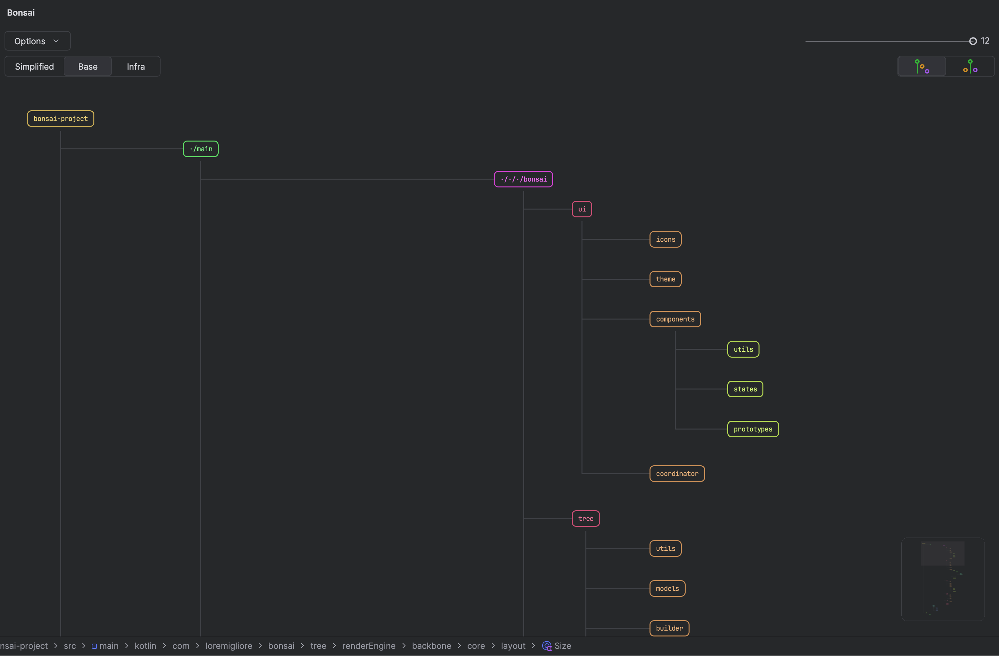

  

<h1 style="text-align: center;">
BONSAI 
</h1>
<h2 style="text-align: center;">
  <b>Project structure visualizer</b>
</h2>
<h4 style="text-align: center;">
Plugin for Intellij based IDEs that provides a visual representation of your project structure on an interactive canvas.
</h4>

<h5>
<!-- Plugin description -->
This toolwindow plugin provides a visual representation of your project structure on an interactive canvas with zoom and pan capabilities.

Configurable filters and display modifiers allow you to control visibility and layout, adapting the view to your needs. 
The current visualization can be exported as SVG or PNG, making it suitable for documentation and sharing.

You can focus on multiple subtrees simultaneously to compare architectural structures and relationships more effectively.
Clicking a file or element opens it directly in the editor for quick navigation.

Additional features: integrated search, export project structure as JSON
<!-- Plugin description end -->
</h5>

## Images

|              **Structure Tree Visualization**              |                    **Structure Comparisons**                    |
|:----------------------------------------------------------:|:---------------------------------------------------------------:|
|  |  |
|                      **Image Export**                      |                       **Tree Modifiers**                        |
|     |        |

## Installation

- Using the IDE built-in plugin system:

  <kbd>Settings/Preferences</kbd> > <kbd>Plugins</kbd> > <kbd>Marketplace</kbd> > <kbd>Search for "visual-project"</kbd> >
  <kbd>Install</kbd>

- Using JetBrains Marketplace:

  Go to [JetBrains Marketplace](https://plugins.jetbrains.com/plugin/MARKETPLACE_ID) and install it by clicking the <kbd>Install to ...</kbd> button in case your IDE is running.

  You can also download the [latest release](https://plugins.jetbrains.com/plugin/MARKETPLACE_ID/versions) from JetBrains Marketplace and install it manually using
  <kbd>Settings/Preferences</kbd> > <kbd>Plugins</kbd> > <kbd>⚙️</kbd> > <kbd>Install plugin from disk...</kbd>

- Manually:

  Download the [latest release](https://github.com/loremigliore/visual-project/releases/latest) and install it manually using
  <kbd>Settings/Preferences</kbd> > <kbd>Plugins</kbd> > <kbd>⚙️</kbd> > <kbd>Install plugin from disk...</kbd>

---
Plugin based on the [IntelliJ Platform Plugin Template][template].

[template]: https://github.com/JetBrains/intellij-platform-plugin-template
[docs:plugin-description]: https://plugins.jetbrains.com/docs/intellij/plugin-user-experience.html#plugin-description-and-presentation

### License
This plugin is published under the open source license: GNU General Public License (GPL)
Ideas, code and designs by me: [loremigliore](https://github.com/loremigliore)

 